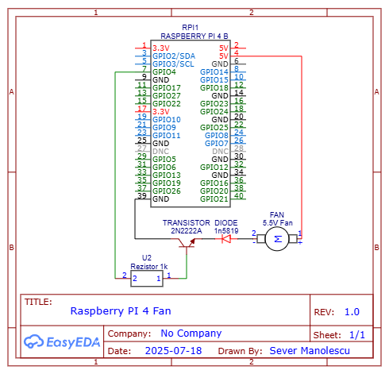

# Raspberry Pi Fan Controller

This Python script automatically controls a fan connected to your Raspberry Pi based on the CPU temperature. It turns the fan **on** when the temperature exceeds a threshold and **off** once it cools down.

---

## Description

The script reads the CPU temperature from the Pi's thermal zone and toggles a GPIO pin (connected to the fan) accordingly:

- Fan **ON** at or above **80°C**
- Fan **OFF** at or below **75°C**

Uses **GPIO 4** (`BCM mode`) for fan control.

---

## Hardware Requirements

- Raspberry Pi (any model with GPIO support)
- 5V Fan (2-pin)
- NPN Transistor (e.g., 2N2222) for switching
- 1kΩ resistor (for base)
- Jumper wires and breadboard or soldered setup
- Optional: Diode (e.g., 1N5819) for flyback protection

**Diagram:** \


---

## Wiring

| Fan Pin              | Connects To                                                           |
|----------------------|-----------------------------------------------------------------------|
| Fan `+` (positive)   | 5V GPIO header                                                        |
| Fan `-` (negative)   | Collector of 2N2222                                                   |
| Transistor Collector | Fan `-` (negative)                                                    |
| Transistor Emitter   | GND                                                                   |
| Transistor Base      | GPIO 4 and transistor base                                            |
| Diode (1N5819)       | Fan `-` (negative) to GND (cathode to GND, anode to fan negative pin) |

---

## Software Setup

### 1. Enable GPIO and install dependencies

```bash
sudo apt update
sudo apt install python3-rpi.gpio
```
For this script, you also need to install the `RPi.GPIO` library if it's not already installed:

```bash
pip install RPi.GPIO
```
or:
```bash
python -m pip install RPi.GPIO
```

### 2. Clone the repository

```bash  
git clone git@github.com:severmanolescu/Crypto-Articles-Bots.git  
cd Crypto-Articles-Bots
```

### 3. Run the script

```bash
python ./scripts/fan_controller/fan_controller.py
```
---
## Auto-Start on Boot
To run the script automatically on boot:
### 1. Open the crontab editor:
```bash
crontab -e
```
### 2. Add the following line at the end:
```bash
@reboot python /path/to/your/fan_controller.py
```
### 3. Save and exit the editor.

---
## Script Details
```python
FAN_PIN = 4  # GPIO 4
ON_TEMP = 80
OFF_TEMP = 75
```
Change `FAN_PIN` to the GPIO pin you are using for the fan control. Adjust `ON_TEMP` and `OFF_TEMP` as needed.

---

## Notes
- Ensure the fan is rated for 5V operation.
- The script requires root privileges to access GPIO pins. You can run it with `sudo` or set up the script to run as a service.
- Test the fan operation manually before relying on the script to ensure everything is wired correctly.
- The project uses a 5V fan, a 3.3V maybe can work with a transistor, but it's not recommended as it may not provide sufficient power.
- The script is designed to run continuously, monitoring the CPU temperature and controlling the fan accordingly.
