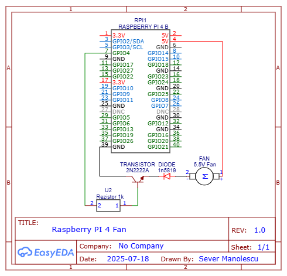

# Raspberry Pi Fan Controller

This Python script automatically controls a fan connected to your Raspberry Pi based on the CPU temperature. It turns the fan **on** when the temperature exceeds a threshold and **off** once it cools down.

---

## Description

The script reads the CPU temperature from the Pi's thermal zone and toggles a GPIO pin (connected to the fan) accordingly:

- Fan **ON** at or above **75°C**
- Fan **OFF** at or below **60°C**

Uses **GPIO 4** (`BCM mode`) for fan control.

---

## Hardware Requirements

| Component        | Specification              | Purpose                              |
|------------------|----------------------------|--------------------------------------|
| Raspberry Pi     | Any model with GPIO        | Main controller                      |
| 5V Fan           | 2-pin                      | Cooling                              |
| NPN Transistor   | 2N2222 or similar          | Switch for fan control               |
| Resistor         | For transistor base        | Current limiting for transistor base |
| Diode (optional) | 1N5819 (optional)          | Flyback protection                   |
| Wires/Breadboard | Jumper wires or breadboard | Connections setup                    |

**Diagram:** \


---

## Wiring

| Fan Pin               | Connects To                                                            | Notes                                   |
|-----------------------|------------------------------------------------------------------------|-----------------------------------------|
| Fan `+` (positive)    | 5V GPIO header                                                         | Powers the fan                          |
| Fan `-` (negative)    | Collector of 2N2222                                                    | Fan controlled by transistor switching  |
| Transistor Collector  | Fan `-` (negative)                                                     | Connected to fan's ground side          |
| Transistor Emitter    | GND                                                                    | Completes the circuit                   |
| Transistor Base       | GPIO 4 and transistor base                                             | Controls transistor switching           |
| Resistor (1kΩ)        | GPIO 4 to base of transistor                                           | Limits base current                     |
| Diode (1N5819)        | Fan `-` (negative) to GND (cathode to GND, anode to fan negative pin)  | Protects transistor from voltage spikes |

---

## Software Setup

### 1. Install dependencies

```bash
sudo apt update
sudo apt install screen -y
```

### 2. Clone the repository

```bash
git clone git@github.com:severmanolescu/Crypto-Articles-Bots.git
cd Crypto-Articles-Bots
```

### 3. Create and activate a virtual environment

```bash
cd scripts/fan_controller
python3 -m venv venv
source venv/bin/activate
```

### 4. Install Python dependencies

```bash
pip install RPi.GPIO
```

### 5. Deactivate the virtual environment

```bash
deactivate
```

### 6. Set-up the variables:
Add the Uptime Kuma URL if you want to send notifications to it:
```python
UPTIME_KUMA_URL = ""
```

---

## Running the Script

### Manual run

```bash
source venv/bin/activate
python fan_controller.py
```

### Run in background using screen

Use the provided start script to run the fan controller in a detached screen session:

```bash
chmod +x start_fan_controller.sh
./start_fan_controller.sh
```

The `start_fan_controller.sh` script:

```bash
#!/bin/bash
SESSION_NAME="fan_controller"
PYTHON_SCRIPT="fan_controller.py"
VENV_PYTHON="/mnt/data/Crypto-Bot-Ecosystem/scripts/fan_controller/venv/bin/python"
export TERM=xterm
screen -dmS "$SESSION_NAME" "$VENV_PYTHON" "$PYTHON_SCRIPT"
```

### Useful screen commands

| Command                    | Description                        |
|----------------------------|------------------------------------|
| `screen -ls`               | List all active screen sessions    |
| `screen -r fan_controller` | Attach to the fan controller session |
| `Ctrl+A then D`            | Detach from session without killing it |

---

## Auto-Start on Boot

To run the script automatically on boot:

### 1. Open the crontab editor

```bash
crontab -e
```

### 2. Add the following line at the end

```bash
@reboot /mnt/data/Crypto-Bot-Ecosystem/scripts/fan_controller/start_controller.sh
```

### 3. Save and exit the editor

---

## Script Details

```python
FAN_PIN = 4  # GPIO 4
ON_TEMP = 75
OFF_TEMP = 60
```

Change `FAN_PIN` to the GPIO pin you are using for fan control. Adjust `ON_TEMP` and `OFF_TEMP` as needed.

---

## Logs

The script logs fan activity to `fan_controller.log` in the same directory as the script, and also prints to the console.

Example log output:
```
2026-03-11 22:00:00 [INFO] Fan controller started
2026-03-11 22:05:12 [INFO] Fan ON - Temp: 75.2°C
2026-03-11 22:10:45 [INFO] Fan OFF - Temp: 59.8°C
```

---

## Notes

- Ensure the fan is rated for 5V operation.
- The script requires root privileges to access GPIO pins. Run it with `sudo` or set up the script to run as a service.
- Test the fan operation manually before relying on the script to ensure everything is wired correctly.
- The project uses a 5V fan. A 3.3V fan may work with a transistor but is not recommended as it may not provide sufficient power.
- The script runs continuously, monitoring CPU temperature and controlling the fan accordingly.
